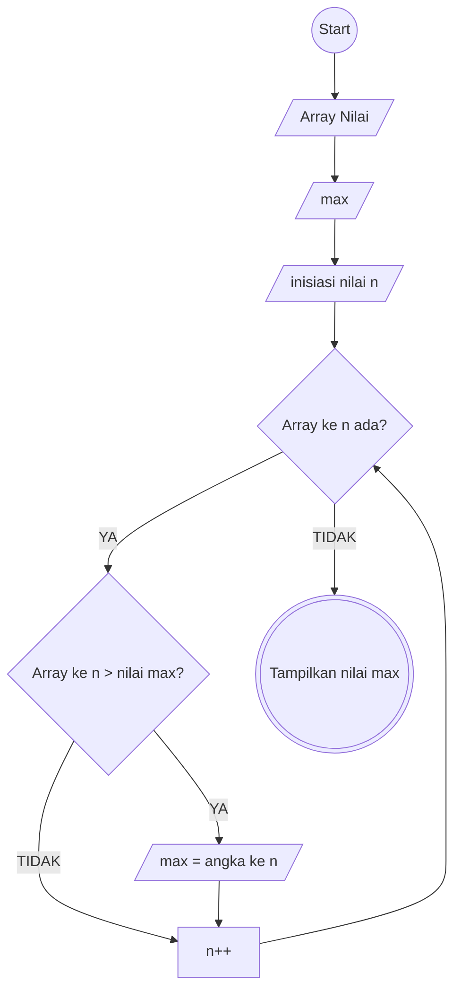
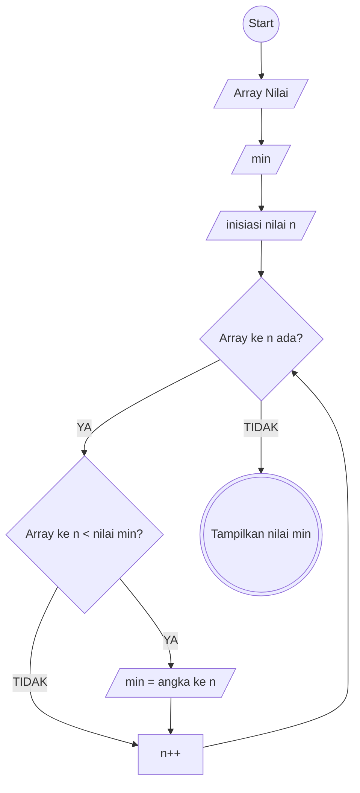
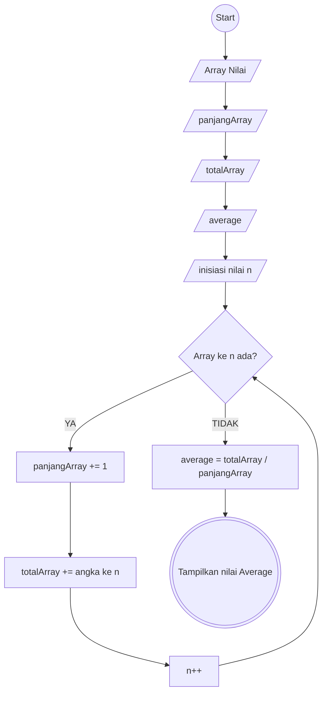

## MAX

```mermaid
flowchart TB
start((Start))
input1[/Array Nilai/]
input4[/max/]
input7[/inisiasi nilai n/]
input8[/max = angka ke n/]
proses1[n++]
check1{Array ke n ada?}
check2{Array ke n > nilai max?}
output1(((Tampilkan nilai max)))
start -->input1
input1-->input4
input4 --> input7
input7 --> check1
check1 -- YA --> check2
check2 -- YA --> input8
check2 -- TIDAK --> proses1
input8 --> proses1
proses1 --> check1
check1 -- TIDAK --> output1
```

## MIN

```mermaid
flowchart TB
start((Start))
input1[/Array Nilai/]
input4[/min/]
input7[/inisiasi nilai n/]
input8[/min = angka ke n/]
proses1[n++]
check1{Array ke n ada?}
check2{Array ke n < nilai min?}
output1(((Tampilkan nilai min)))
start -->input1
input1-->input4
input4 --> input7
input7 --> check1
check1 -- YA --> check2
check2 -- YA --> input8
check2 -- TIDAK --> proses1
input8 --> proses1
proses1 --> check1
check1 -- TIDAK --> output1
```

## AVERAGE

```mermaid
flowchart TB
start((Start))
input2[/panjangArray/]
input3[/totalArray/]
input6[/average/]
input1[/Array Nilai/]
input7[/inisiasi nilai n/]
proses1[n++]
proses2[panjangArray += 1]
proses3[totalArray += angka ke n]
proses3[totalArray += angka ke n]
proses4[average = totalArray / panjangArray]
check1{Array ke n ada?}
output1(((Tampilkan nilai Average)))
start -->input1
input1-->input2-->input3-->input6
input6 --> input7
input7 --> check1
check1 -- YA --> proses2-->proses3 --> proses1
proses1 --> check1
check1 -- TIDAK --> proses4-->output1
```
