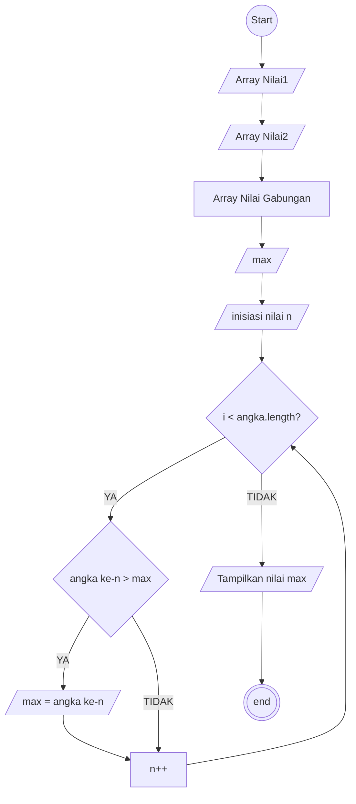
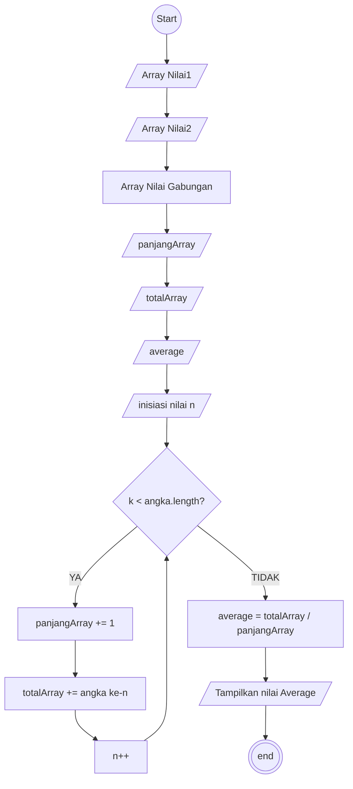

## MAX

```mermaid
flowchart TB
start((Start))
input1[/Array Nilai1/]
input11[/Array Nilai2/]
input4[/max/]
input7[/inisiasi nilai n/]
input8[/max = angka ke-n/]
proses1[n++]
proses12[Array Nilai Gabungan]
check1{i < angka.length?}
check2{angka ke-n > max}
output1[/Tampilkan nilai max/]
selesai(((end)))
start -->input1-->input11-->proses12
proses12-->input4
input4 --> input7
input7 --> check1
check1 -- YA --> check2
check2 -- YA --> input8
check2 -- TIDAK --> proses1
input8 --> proses1
proses1 --> check1
check1 -- TIDAK --> output1 --> selesai
```

## MIN

```mermaid
flowchart TB
start((Start))
input1[/Array Nilai1/]
input11[/Array Nilai2/]
input4[/min/]
input7[/inisiasi nilai n/]
input8[/min = angka ke-n/]
proses1[n++]
proses112[Array Nilai Gabungan]
check1{j < angka.length?}
check2{angka ke-n < min}
output1[/Tampilkan nilai min/]
selesai(((end)))
start -->input1-->input11-->proses112
proses112-->input4
input4 --> input7
input7 --> check1
check1 -- YA --> check2
check2 -- YA --> input8
check2 -- TIDAK --> proses1
input8 --> proses1
proses1 --> check1
check1 -- TIDAK --> output1 --> selesai
```

## AVERAGE

```mermaid
flowchart TB
start((Start))
input2[/panjangArray/]
input3[/totalArray/]
input6[/average/]
input1[/Array Nilai1/]
input11[/Array Nilai2/]
input7[/inisiasi nilai n/]
proses1[n++]
proses2[panjangArray += 1]
proses3[totalArray += angka ke-n]
proses4[average = totalArray / panjangArray]
proses122[Array Nilai Gabungan]
check1{k < angka.length?}
output1[/Tampilkan nilai Average/]
selesai(((end)))
start -->input1-->input11-->proses122
proses122-->input2-->input3-->input6
input6 --> input7
input7 --> check1
check1 -- YA --> proses2-->proses3 --> proses1
proses1 --> check1
check1 -- TIDAK --> proses4-->output1 --> selesai
```
