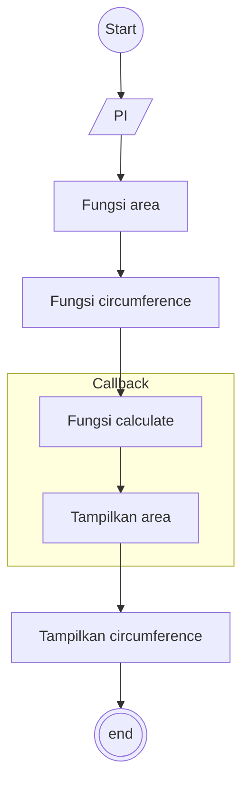

1. Membuat variabel PI
2. Membuat fungsi area untuk menghitung luas lingkaran yang akan di callback nanti, yang mereturn menampilkan hasil hitung di terminal
3. Membuat fungsi circumference untuk menghitung keliling lingkaran yang akan di callback nanti, yang mereturn menampilkan hasil hitung di terminal
4. Membuat fungsi calculate untuk mengcallback 2 fungsi sebelumnya
5. Panggil Fungsi calculate untuk mengcallback fungsi area
6. Panggil Fungsi calculate untuk mengcallback fungsi circumference

